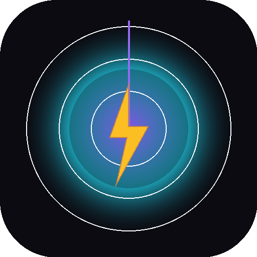

# StormScope

> Your personal storm radar. Live rain, storm motion, and sky awareness around your location.

A premium mobile-first PWA built as a sibling to [Wingman](https://github.com/karel008-sudo/wingman). Dark cinematic UI, smooth radar animation, glass-card information density, no accounts, no servers, no data leaves your device.



## Features

- 🌩️ **Live radar overlay** — RainViewer global radar tiles centered on your location
- ⏱️ **Timeline scrubber** — replay the available history with play / pause / step / "Now" snap
- 📡 **Forecast frames** — when the provider exposes nowcast (typically the next ~30 min), they appear after "Now" in the timeline; otherwise the UI says so honestly
- 📍 **Geolocation** — manual flow with a clear invitation card; animated pulse marker; optional auto-follow; last-known position cached locally
- 📱 **Real PWA** — installable, standalone mode, viewport-fit cover, safe-area handling, dark theme color
- 💾 **Local-first** — settings persist via IndexedDB (Dexie); last RainViewer metadata cached for offline shell
- 🔌 **Offline-aware** — service worker runtime caching for tiles and metadata; visible offline banner
- ✨ **Haptic feedback** — Web Vibration API for tactile interactions (configurable)
- 🎨 **Premium UI** — glassmorphism, glow accents, motion easing, custom scrubber, intensity legend
- ♿ **A11y** — focus-visible rings, aria-labels on icon buttons, role=switch toggles, reduced-motion (system + user)

## Quick start

```bash
npm install
npm run dev      # http://localhost:5173
npm run build    # → dist/
npm run preview  # production preview
npm run lint     # ESLint
npm test         # Vitest (provider + utils)
```

Requires Node 18+ (tested on 20+ and 24).

## Data sources

| Layer | Source | Notes |
|---|---|---|
| Radar tiles | [RainViewer](https://www.rainviewer.com/) Public Weather Maps API | Free for personal & educational use; ~2 h history at 10-min cadence; nowcast availability varies |
| Base map | OpenStreetMap raster via [CARTO Dark Matter](https://carto.com/) | Attribution required |
| Geolocation | Browser Geolocation API | High-accuracy mode; last position cached locally |

**Honesty notes (intentional):**

- The provider currently exposes about **2 hours of past frames** at ~10-min intervals — not 12 hours. The UI never claims 12 h.
- **Nowcast frames are only shown when RainViewer actually returns them.** If empty, the Timeline page shows *"Forecast frames currently unavailable from this provider"*.
- **No lightning data** is implemented (Blitzortung does not provide a free public API for raw strikes).
- **No precise distance/intensity readings** around your location are computed from tile pixels — that would require sampling against a known colormap, which is fragile.
- A `stale` flag is exposed when the latest available frame is older than 15 minutes (e.g. provider hiccup).

## Architecture

```
src/
  App.jsx                    tab shell, splash, lazy-loaded Insights
  main.jsx                   entry, manual SW registration (updateViaCache: 'none')
  index.css                  design tokens, reduced-motion, custom range controls
  db.js                      Dexie KV store (settings, RV cache, last location)
  haptic.js                  Web Vibration wrapper (7 patterns; on/off respect)
  constants.js               provider config, color tokens, intensity bands
  providers/
    rainviewerProvider.js    fetch + defensive normalize + isStale + tile URL builder
    weatherProviderTypes.js  abstraction notes for future ČHMÚ / Blitzortung
  hooks/
    useGeolocation.js        manual flow, cached restore, watch-position
    useRainViewerFrames.js   network + cache fallback + visibility-aware refresh
    useTimelinePlayer.js     play/pause/scrub/step + "Now" snap, signature-stable resnap
    usePersistentSettings.js Dexie-backed settings with haptics gate
  components/
    AppShell.jsx             page wrapper, bottom-nav clearance
    BottomNav.jsx            tab bar (animated underline indicator)
    GlassCard.jsx            recipe primitive
    StatusCard.jsx           top-of-screen feed status (provider, counts, stale, fromCache)
    TimelineControl.jsx      scrubber + play/pause + Now snap (44px tap targets)
    RadarMap.jsx             Leaflet + radar overlay + user pulse + invalidateSize
    LocationButton.jsx       pill button with status states
    FrameBadge.jsx           Past / Now / Forecast chip
    ProviderBadge.jsx        breathing live dot
    IntensityLegend.jsx      color-band reference
    PermissionState.jsx      denied / unsupported / error / offline panels
    OfflineBanner.jsx        navigator.onLine driven banner
    UpdatePrompt.jsx         stub (autoUpdate is silent)
  pages/
    Radar.jsx                hero — full-bleed map + status + locate invite + timeline
    Timeline.jsx             frame replay log (Past / Now / Forecast sections)
    Insights.jsx             metadata + readiness cards + Recharts chart (lazy-loaded)
    Settings.jsx             opacity, speed, zoom, layers, color scheme, haptics, reduce motion
  utils/
    time.js                  fmtClock, relativePhrase, minutesBetween
    format.js                fmtCoords, clamp, pluralize
    map.js                   Leaflet icon shim (CDN)
public/
  favicon.svg
  pwa-192.png  pwa-512.png  pwa-maskable-512.png  apple-touch-icon.png
tests/
  rainviewerProvider.test.js  16 tests
  utils.test.js               10 tests
```

## Design DNA (mirror of Wingman)

| Token | Value |
|---|---|
| Background | `#0b0b11` |
| Surface | `rgba(255,255,255,0.04)` |
| Border | `rgba(255,255,255,0.08)` |
| Primary | `#8b5cf6` (violet) |
| Storm accent | `#22d3ee` (electric cyan) |
| Lightning accent | `#fbbf24` (amber) |
| Danger | `#f43f5e` (rose) |
| Text-1 / 2 / 3 | `#f8f8ff` / `#d4d4d8` / `#71717a` |

Glass cards use `backdrop-filter: blur()`, hairline borders, no solid backgrounds. Bottom nav has an animated underline indicator. iOS safe-area is handled with `env(safe-area-inset-*)` everywhere it matters.

## Deployment (Netlify)

`netlify.toml` is included. Drop the repo into Netlify, build command `npm run build`, publish directory `dist`. SPA fallback to `/index.html` is configured. Service-worker file is sent with `no-cache` so updates ship reliably (especially on iOS).

```toml
[build]
  command = "npm run build"
  publish = "dist"

[[headers]]                      # SW must never be cached
  for = "/sw.js"
  [headers.values]
    Cache-Control = "no-cache, no-store, must-revalidate"
```

## PWA install (iOS Safari)

1. Open the deployed URL in Safari (not Chrome on iOS — Chrome on iOS lacks PWA install).
2. Tap **Share** → **Add to Home Screen**.
3. Open the new icon — StormScope launches in standalone mode (no browser chrome). Status bar is translucent dark.

## Real device QA checklist (iPhone)

Run through this list after every meaningful deploy.

**Install & shell**
- [ ] Open the deployed URL in Safari on iOS (not Chrome on iOS — only Safari can install PWAs there)
- [ ] **Share → Add to Home Screen** — title shows as `StormScope`
- [ ] Tap the new home-screen icon — app launches in **standalone** mode (no Safari URL bar, no tab strip, status bar reads as dark translucent)
- [ ] Splash screen appears for ~0.5 s then transitions to the radar map

**Permissions — happy path**
- [ ] First launch shows the *"Center the radar on you?"* glass card AND a **Locate me** pill
- [ ] Tap **Locate me** → iOS prompts for location → tap **Allow While Using App**
- [ ] Map flies to your location, the violet pulse marker appears
- [ ] Light haptic tick fires on success

**Permissions — denied path**
- [ ] Force-quit the app (swipe up, swipe up on the StormScope card)
- [ ] Settings → Privacy & Security → Location Services → Safari → **Never** *(or for the standalone PWA: Settings → StormScope → Location → Never)*
- [ ] Re-launch StormScope, tap **Locate me** twice quickly
- [ ] App must show the **"Location blocked"** card with iOS / macOS / desktop guidance — NOT a generic error
- [ ] Map still renders (centered on Prague), bottom nav still works, no white screen

**Connectivity**
- [ ] Settings → Airplane Mode **on**
- [ ] App shows the amber **"Offline shell active"** banner at the top
- [ ] StatusCard pushes down by banner height — they do not overlap
- [ ] Map still shows whatever tiles were already cached
- [ ] Switch tabs — Timeline / Insights / Settings all open without crash
- [ ] Airplane Mode **off** → banner disappears within ~1 s, refresh fires automatically on visibility change

**Radar playback**
- [ ] Radar tab → tap the violet **Play** button (or `aria-label="Play radar animation"`)
- [ ] Frames advance every ~650 ms (or per Settings → Animation speed)
- [ ] Subtle haptic pulse fires when playback crosses **Past → Forecast** boundary (only if RainViewer returned forecast frames)
- [ ] Drag the scrubber — frame & timestamp update live (no need to release on iOS)
- [ ] Tap **NOW** chip — snaps to latest sweep, light haptic
- [ ] Background the app for 30 s, foreground it — playback resumes (interval was paused on `visibilitychange:hidden`)

**Settings persistence**
- [ ] Settings tab → Radar opacity to 30 % → Animation speed to **Fast** → toggle Haptics off → pick a different **Color scheme** chip
- [ ] Force-quit the PWA, reopen — every change above is still there
- [ ] Color scheme chip change reflects immediately on the radar overlay (a fresh tile layer rebuilds)

**Update after new deployment**
- [ ] On Netlify, push a new commit and let it deploy
- [ ] Open the already-installed PWA on the phone — within seconds the new SW activates and the page silently reloads (controllerchange handler with 60 s cooldown guard, so no reload loop)
- [ ] If you need to force it: force-quit + relaunch

**Visual polish**
- [ ] Status card text is legible at the very top (no notch overlap)
- [ ] Bottom nav clears the iPhone home indicator (safe-area inset-bottom respected)
- [ ] Leaflet attribution is visible above the bottom nav, not hidden underneath
- [ ] No accidental horizontal scroll, no rubber-band overflow at top/bottom outside the map

## Troubleshooting

**"Permission needed" / location is denied**
On iOS Safari: Settings → Safari → Location → Allow. On Chrome desktop: click the padlock in the URL bar → Site settings → Location → Allow. Reload, then tap **Locate me**.

**Map renders gray / blank**
Hard-reload the page (Cmd-Shift-R). The `SizeKeeper` hook calls `invalidateSize()` on tab switches, orientation changes, and visibility changes, so this should be rare. If it persists, your network is probably blocking `*.basemaps.cartocdn.com` — check devtools Network tab.

**Service worker stuck on old version (iOS)**
The app uses `registerType: 'autoUpdate'` and `updateViaCache: 'none'` (set in `src/main.jsx`). On iOS, force it: open the app, swipe up to background, force-quit, relaunch — the new SW activates. Or visit `/?reload=1` to bypass cache once.

**Offline behavior**
After the first online load, the app shell + last RainViewer metadata are cached. The `OfflineBanner` appears when `navigator.onLine === false`. The radar overlay falls back to whatever tiles were already in the runtime cache.

**Forecast frames missing**
RainViewer's free `nowcast` array is sometimes empty. This is a provider quirk, not a bug. The Timeline page shows *"Forecast frames currently unavailable from this provider"* when this happens.

## Quality bar

| Tool | Result |
|---|---|
| `npm run lint` | **0 errors, 0 warnings** (ESLint flat config + react + react-hooks) |
| `npm test` | **26 unit tests** (provider normalization edge cases, tile URL, isStale, time/format helpers) |
| `npm run test:e2e` | **8 Playwright smoke tests** on Pixel 7 mobile viewport — app loads, map visible, nav switches, settings persist after reload, geo-denied does not crash, empty nowcast handled, timeline renders, manifest+SW served |
| `npm run build` | clean — initial JS chunk 458 KB (143 KB gzip), Insights lazy-loaded as a separate 371 KB chunk (104 KB gzip) |
| Lighthouse PWA | manifest valid, service worker installed, maskable icon present |

## Roadmap

- [ ] **ČHMÚ / CZRAD provider** via small backend proxy (Cloudflare Worker + R2 ring buffer for ~7 days at 5-min cadence over Czech Republic). Includes +60-min nowcast (FCT_PseudoCAPPI_2km).
- [ ] **Blitzortung lightning archive overlay** via backend proxy (their `archive_data.php` returns rendered PNG maps).
- [ ] **Geostationary satellite cloud cover** via ČHMÚ Meteosat feed.
- [ ] **12-hour radar archive** server-side (ring buffer of preprocessed PNGs).
- [ ] iOS PWA install hint flow (custom prompt for browsers that don't expose `beforeinstallprompt`).
- [ ] Settings sync via QR (cross-device, no account).

## License

MIT
